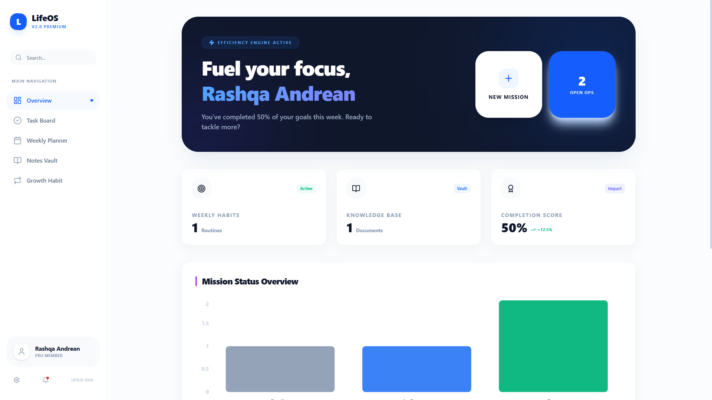
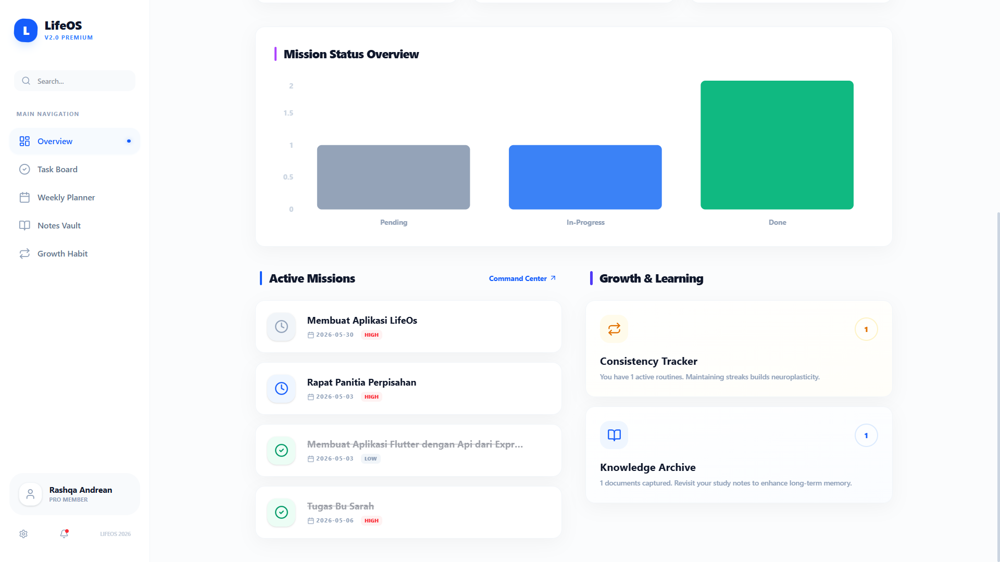
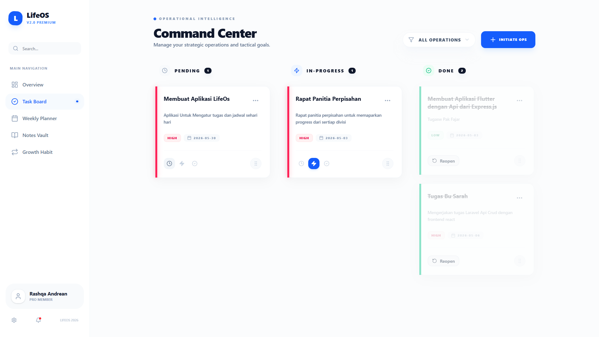
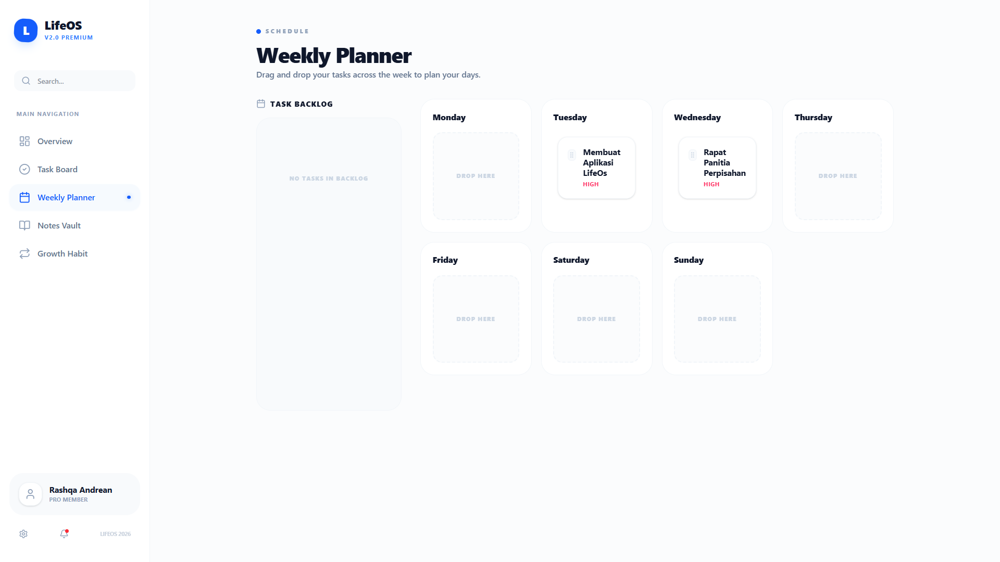
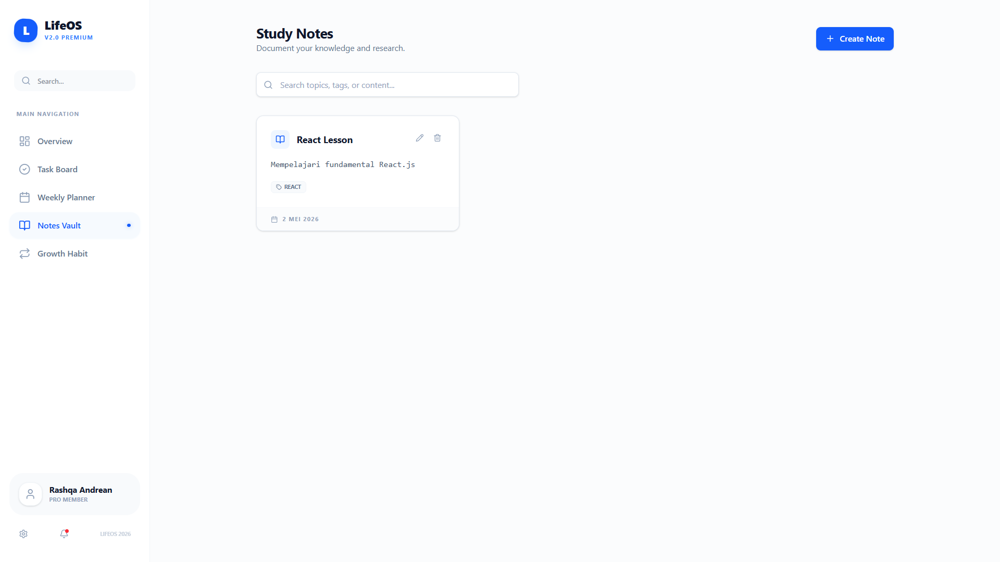
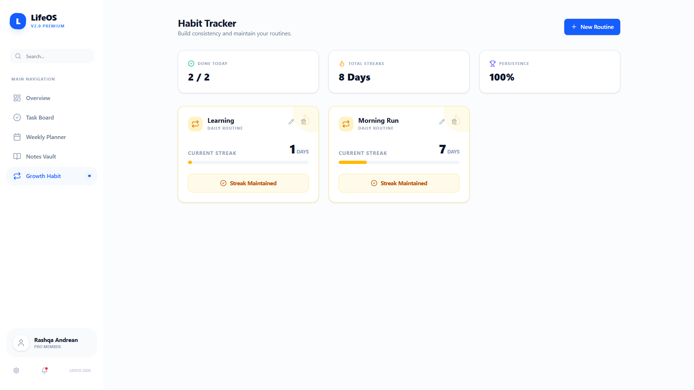
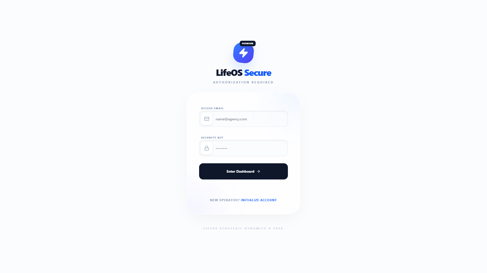
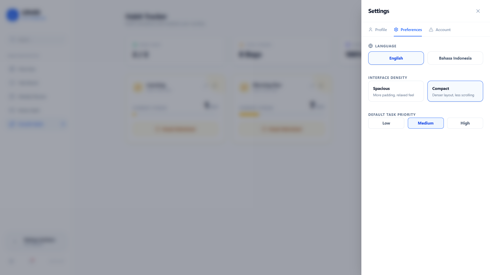

# LifeOS 🚀 - Personal Productivity Intelligence



LifeOS adalah suite produktivitas personal premium berperforma tinggi yang dirancang untuk mensentralisasi manajemen hidup Anda. Dibangun dengan filosofi "Privacy First" dan "Speed Second", aplikasi ini menggabungkan manajemen tugas, pengarsipan basis pengetahuan, dan pelacakan kebiasaan ke dalam satu pengalaman yang kohesif dan mulus.

---

## ✨ Fitur Utama

### 📊 Intelligence Dashboard
Pusat komando tingkat tinggi yang menampilkan analitik status misi secara real-time, pelacakan efisiensi, dan kartu akses cepat untuk semua operasi vital.


### 🗓️ Weekly Planner & Task Board
Manajemen tugas gaya Kanban yang dinamis dengan Weekly Planner khusus untuk penjadwalan strategis. Menampilkan interaksi drag-and-drop yang mulus bertenaga `@dnd-kit`.



### 📓 Study Notes Vault
Repositori efisien untuk aset intelektual Anda. Kelola riset, materi studi, dan wawasan pribadi dengan tag dan pencarian real-time.


### 🧘 Habit Tracker (Consistency Engine)
Bangun momentum tak terhentikan dengan sistem pelacakan kebiasaan yang canggih. Termasuk validasi streak untuk memastikan autentisitas dan statistik progres real-time.


### 🔐 Autentikasi Aman & Pengaturan
Keamanan kelas enterprise dengan pengalaman login/register premium. Kendali penuh atas profil dan preferensi Anda.



---

## 🛠️ Stack Teknologi

**Frontend:**
- **React 18** (Vite)
- **Tailwind CSS** (Premium UI/UX)
- **Framer Motion** (Motion Design)
- **Recharts** (Visualisasi Data)
- **Lucide React** (Ikonografi)
- **react-i18next** (Dukungan Multibahasa: EN/ID)
- **@dnd-kit** (Logika Drag & Drop)

**Backend:**
- **Laravel 11**
- **PHP 8.2+**
- **MySQL/PostgreSQL**
- **Sanctum** (Autentikasi API)

---

## 🚀 Memulai

### Prasyarat
- Node.js (v18+)
- PHP (v8.2+)
- Composer

### Instalasi

1. **Clone repositori:**
   ```bash
   git clone https://github.com/Rasshqa/Life-Os.git
   cd life-os
   ```

2. **Pengaturan Frontend:**
   ```bash
   cd life-os-frontend
   npm install
   npm run dev
   ```

3. **Pengaturan Backend:**
   ```bash
   cd ../life-os-backend
   composer install
   cp .env.example .env
   php artisan key:generate
   php artisan migrate
   php artisan serve
   ```

---

## 🌍 Internasionalisasi

LifeOS sepenuhnya dilokalisasi untuk mendukung pengguna global:
- 🇺🇸 **English** (Bahasa Operasi Standar)
- 🇮🇩 **Bahasa Indonesia** (Fokus Lokalisasi)

---

## 🛡️ Keamanan
LifeOS menggunakan **Laravel Sanctum** untuk autentikasi berbasis token yang aman. Setiap pembaruan status misi dan entri pengetahuan dilindungi oleh kebijakan (policy) tingkat model.

---

## 🎨 Sistem Desain
- **Tema:** Minimalist Light Mode (Professional Blue, Slate, & White)
- **Tipografi:** Outfit & Inter
- **Estetika:** Glassmorphism & Presisi Kontras Tinggi

---

<p align="center">
  <b>LifeOS Strategic Dynamics © 2026</b><br>
  <i>Memicu fokus, satu misi setiap waktu.</i>
</p>
